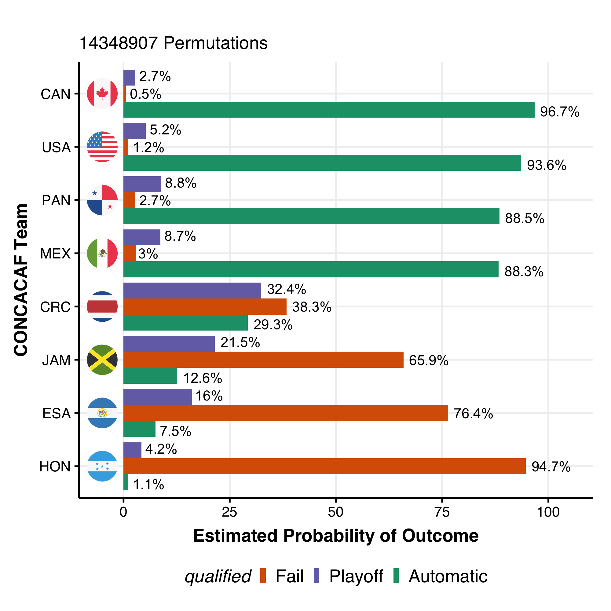

# CONCACAF_qualifying
Modeling CONACAF World Cup Qualifying using a basic model.
For each simulation of the remaining matches to be played, the home team is randomly assigned an outcome (either 3, 1 or 0 points for a win, draw or loss). The final table is aggregated, returning a total of points over the course of qualifying for those simulated results.

Probabilistically, match outcomes in this model are uniformly distributed, and thus there is no measure of skill afforded by this model. Over a large number of simulations, this should not matter as much, but as fewer matches remain, the influence of obvious sporting factors, including but not limited to, player skill, player availability, form, home advantage, team form, pressure, etc will have a greater impact on match outcome odds.

This software runs very slowly if n.sims is greater than 3^10. 

#Dependencies
Requires R and the following CRAN packages to be installed:

* [TouRnament](https://cran.r-project.org/web/packages/TouRnament) for the roundrobin function
* [reshape2](https://cran.r-project.org/web/packages/reshape2)
* [matrixStats](https://cran.r-project.org/web/packages/matrixStats)
* [dplyr](https://cran.r-project.org/web/packages/dplyr)

For plotting & country codes/flag decoration:

* [ggplot2](https://cran.r-project.org/web/packages/ggplot2)
* [ggflags](https://github.com/jimjam-slam/ggflags) for the round images of country flags
* [countrycode](https://cran.r-project.org/web/packages/countrycode) for conversion of country codes for compatibility with ggflags
* [ggimage](https://cran.r-project.org/web/packages/ggimage)

For parallel processing:

[future.apply](https://cran.r-project.org/web/packages/future.apply/) (Not strictly necessary, but important for high values of n.sims) 

All match results are as of 27 Jan 2022

